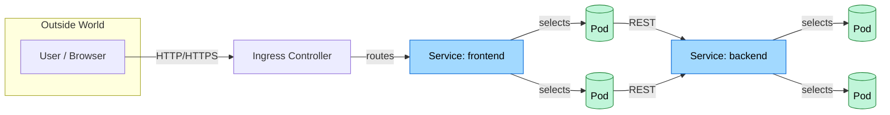

# 🧭 Advanced Kubernetes Networking Lab

Welcome to the **Advanced Kubernetes Networking Lab**.  
This guide walks you through deploying and securing multi‑tier applications while deep‑diving into real‑world **Kubernetes networking** tools and concepts.

---

## 🌟 Kubernetes Basics — Quick Recap

Before we jump into advanced networking, here’s a 60‑second refresher on the core building blocks you’ll be working with:

| Building Block | What It Is | Why It Matters |
|----------------|------------|----------------|
| **Cluster** | The entire Kubernetes control‑plane + worker nodes | Runs and manages all workloads |
| **Node** | A single VM/host inside the cluster | Provides CPU / memory where Pods run |
| **Pod** | Smallest deployable unit that wraps one or more containers sharing the same network namespace | Gets its **own IP** and is the primary target selected by Services |
| **Deployment** | Declarative controller that ensures the desired number of Pod replicas | Handles rolling updates & self‑healing |
| **Service** | Stable virtual IP + DNS name that load‑balances traffic to a set of Pods | Decouples clients from changing Pod IPs |
| **Ingress** | L7 HTTP/HTTPS router that brings external traffic into Services | Single entry point with path / host‑based routing |
| **NetworkPolicy** | Firewall rules for Pod‑to‑Pod (and Pod‑to‑world) traffic | Enables zero‑trust micro‑segmentation |
| **CNI Plugin** | Low‑level network provider that gives Pods IPs & enforces policies | Under the hood wiring for all traffic |

### 📈 Big‑Picture Diagram

*Legend*: External traffic enters through **Ingress**, reaches a **Service** which load‑balances to healthy **Pods**.  Internal calls cascade through additional Services.  **NetworkPolicies** (not shown) restrict who can talk to whom, and the **CNI plugin** wires the packets.

---

## 📘 Outline

Each section builds upon the last, so it's best to follow them in order:

1. [Part 1: Pre-requisites](part-1-pre-requisites.md)
2. [Part 2: Kubernetes Networking Concepts](part-2-kubernetes-networking-concepts.md)
3. [Part 3: Deploy Multi-Tier Application](part-3-deploy-multi-tier-application.md)
4. [Part 4: Explore Kubernetes Service Types](part-4-explore-kubernetes-service-types.md)
5. [Part 5: Apply Network Policies](part-5-apply-network-policies.md)
6. [Part 6: Ingress and External Access](part-6-ingress-and-external-access.md)
7. [Part 7: Cleanup and Conclusion](part-7-cleanup-and-conclusion.md)
