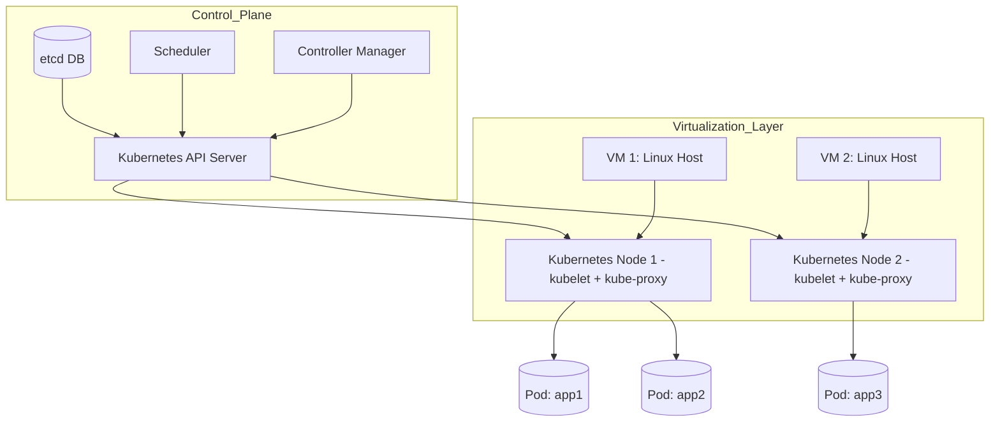

# 🧭 Advanced Kubernetes Networking Lab

Welcome to the **Advanced Kubernetes Networking Lab**.  
This guide walks you through deploying and securing multi‑tier applications while deep‑diving into real‑world **Kubernetes networking** tools and concepts.

---

## 🌟 Kubernetes Basics — Quick Recap

Before we jump into advanced networking, here’s a 60‑second refresher on the core building blocks you’ll be working with:

| Building Block | What It Is | Why It Matters |
|----------------|------------|----------------|
| **Cluster** | The entire Kubernetes control‑plane + worker nodes | Runs and manages all workloads |
| **Node** | A single VM/host inside the cluster | Provides CPU / memory where Pods run |
| **Pod** | Smallest deployable unit that wraps one or more containers sharing the same network namespace | Gets its **own IP** and is the primary target selected by Services |
| **Deployment** | Declarative controller that ensures the desired number of Pod replicas | Handles rolling updates & self‑healing |
| **Service** | Stable virtual IP + DNS name that load‑balances traffic to a set of Pods | Decouples clients from changing Pod IPs |
| **Ingress** | L7 HTTP/HTTPS router that brings external traffic into Services | Single entry point with path / host‑based routing |
| **NetworkPolicy** | Firewall rules for Pod‑to‑Pod (and Pod‑to‑world) traffic | Enables zero‑trust micro‑segmentation |
| **CNI Plugin** | Low‑level network provider that gives Pods IPs & enforces policies | Under the hood wiring for all traffic |

### 📈 Big‑Picture Diagram

**Summary of Components:**

### 🧱 Control Plane
The **Kubernetes control plane** is the brain of the cluster. It manages the lifecycle of applications, scheduling, scaling, networking, and maintaining the desired state.

- **API Server**: The front-end to the control plane. It exposes the Kubernetes API and handles all internal and external communication with the cluster.
- **Scheduler**: Assigns Pods to Nodes based on resource requirements and availability.
- **Controller Manager**: Reconciles the cluster’s actual state with the desired state (e.g., rescheduling a failed Pod).
- **etcd**: A consistent and highly available key-value store used to persist all cluster configuration and state.

All communication flows through the API Server, which acts as the central hub.

### 🖥️ Virtualization Layer
The **Virtualization Layer** represents the infrastructure that runs the Kubernetes nodes. These can be:

- Virtual Machines (e.g., using Docker Desktop, VirtualBox, or a cloud provider like AWS/GCP/Azure)
- Bare-metal servers (in on-premise data centers)

Each VM/host runs one or more **Kubernetes nodes**.

- **VM / Linux Host**: The physical or virtual machines running your cluster. These form the base layer of the infrastructure (often managed by cloud providers or local virtualization like Docker Desktop).

- **Kubernetes Node**: A worker machine (VM or physical) that runs Pods. Each node runs:
  - `kubelet`: an agent that communicates with the Kubernetes control plane and ensures containers are running.
  - `kube-proxy`: a network proxy that maintains network rules for Pod communication and implements Kubernetes Services networking.

- **Pod**: The smallest deployable unit in Kubernetes. Each pod holds one or more containers that share the same network namespace. They are ephemeral and scheduled by controllers.

- **API Server**: The front-end of the Kubernetes control plane. It exposes the Kubernetes API and is the main interface for all cluster operations.

- **Controller Manager**: Handles background tasks such as managing node status, ensuring desired state for Deployments, and managing endpoints.

- **Scheduler**: Assigns newly created Pods to Nodes based on resource requirements, policies, and availability.

- **etcd**: A distributed key-value store that stores all cluster data. It acts as the single source of truth for the cluster state.

All components communicate via the API Server. Nodes do not communicate directly with `etcd`.

Pods are deployed through declarative resources (like Deployments), and the control plane ensures their desired state is maintained.

---

## 📘 Outline

Each section builds upon the last, so it's best to follow them in order:

1. [Part 1: Pre-requisites](part-1-pre-requisites.md)
2. [Part 2: Kubernetes Networking Concepts](part-2-kubernetes-networking-concepts.md)
3. [Part 3: Deploy Multi-Tier Application](part-3-deploy-multi-tier-application.md)
4. [Part 4: Explore Kubernetes Service Types](part-4-explore-kubernetes-service-types.md)
5. [Part 5: Apply Network Policies](part-5-apply-network-policies.md)
6. [Part 6: Ingress and External Access](part-6-ingress-and-external-access.md)
7. [Part 7: Cleanup and Conclusion](part-7-cleanup-and-conclusion.md)
