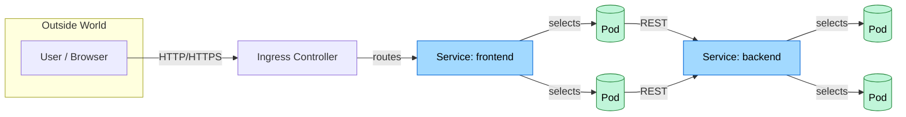

## ⚙️ Part 3: Deploy Multi-Tier Application

With the networking foundation covered, let's deploy a simple multi-tier application to see Kubernetes networking in action.


---

### Architecture


External traffic enters through **Ingress**, reaches a **Service** which load‑balances to healthy **Pods**.  Internal calls cascade through additional Services.  **NetworkPolicies** restrict who can talk to whom, and the **CNI plugin** wires the packets

This setup includes:
- A **backend** pod responding on HTTP
- A **frontend** pod acting as a consumer
- A **test pod** to simulate internal access

---

### ✅ Step 1: Create the Backend Deployment and Service

You will need to clone and build the sample backend service from [here](https://github.com/NewtonDevops/python-backend)

```yaml
apiVersion: v1
kind: Service
metadata:
  name: backend
spec:
  selector:
    app: backend
  ports:
  - port: 8080
    targetPort: 8080
---
apiVersion: apps/v1
kind: Deployment
metadata:
  name: backend
spec:
  replicas: 1
  selector:
    matchLabels:
      app: backend
  template:
    metadata:
      labels:
        app: backend
    spec:
      containers:
      - name: backend
        image: python-backend:latest
        ports:
        - containerPort: 8080
```

Apply it:
```bash
kubectl apply -f backend.yaml
```

---

### ✅ Step 2: Create the Frontend Deployment and Service

You will need to build the frontend application [here](https://github.com/NewtonDevops/frontend-app/tree/main)

```yaml
apiVersion: v1
kind: Service
metadata:
  name: frontend
spec:
  selector:
    app: frontend
  ports:
  - port: 80
    targetPort: 80
---
apiVersion: apps/v1
kind: Deployment
metadata:
  name: frontend
spec:
  replicas: 1
  selector:
    matchLabels:
      app: frontend
  template:
    metadata:
      labels:
        app: frontend
    spec:
      containers:
      - name: frontend
        image: frontend-app:latest
        ports:
        - containerPort: 80
```

Apply it:
```bash
kubectl apply -f frontend.yaml
```

---

### 🔍 Inspect Logs or Describe a Pod

To view logs from a Pod:
```bash
kubectl logs <pod-name> -n adv-net-lab
```

To describe the details of a Pod:
```bash
kubectl describe pod <pod-name> -n adv-net-lab
```
This shows metadata, events, container status, restart counts, and reasons for failures.

---
To rollout restart a deployment
```bash
kubectl rollout restart deploy <deployment-name>
```
---

### ✅ Step 3: Test Internal Communication

Create a deployment for testing

```yaml
apiVersion: apps/v1
kind: Deployment
metadata:
  name: testbox-allow
  namespace: adv-net-lab
spec:
  replicas: 1
  selector:
    matchLabels:
      app: testbox-allow
  template:
    metadata:
      labels:
        app: testbox-allow
    spec:
      containers:
      - name: testbox-allow
        image: busybox:1.35
        command: ["sleep", "3600"]

```
Exec inside the pod
``` sh
kubectl exec -it <pod-name> -- sh
```

Test the backend service 

```sh
nslookup backend
wget -qO- backend:8080
```

✅ You should see: `Hello from backend`

---

### 🎯 Deployment via Helm
Rather than write raw Kubernetes YAML files, we’ll deploy the multi-tier app using a Helm chart.

📦 Source Code & Helm Charts
🔗 https://github.com/NewtonDevops/helm-multi-tier-app

That repo contains:

Helm chart structure with frontend, backend, and testboxes as subcharts

Docker build instructions for the backend

Values templates to configure and redeploy


➡️ [Continue to Part 4: Explore Kubernetes Service Types](part-4-explore-kubernetes-service-types.md)
